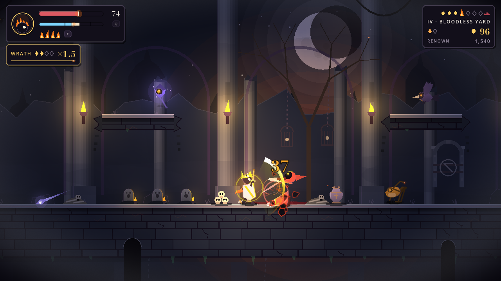
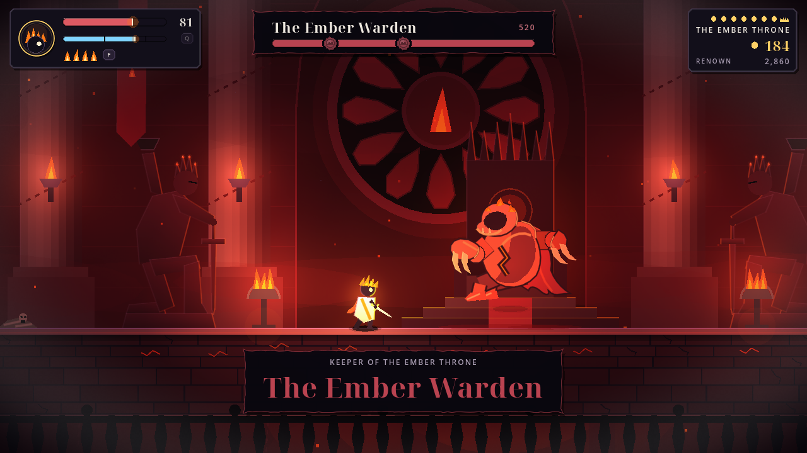
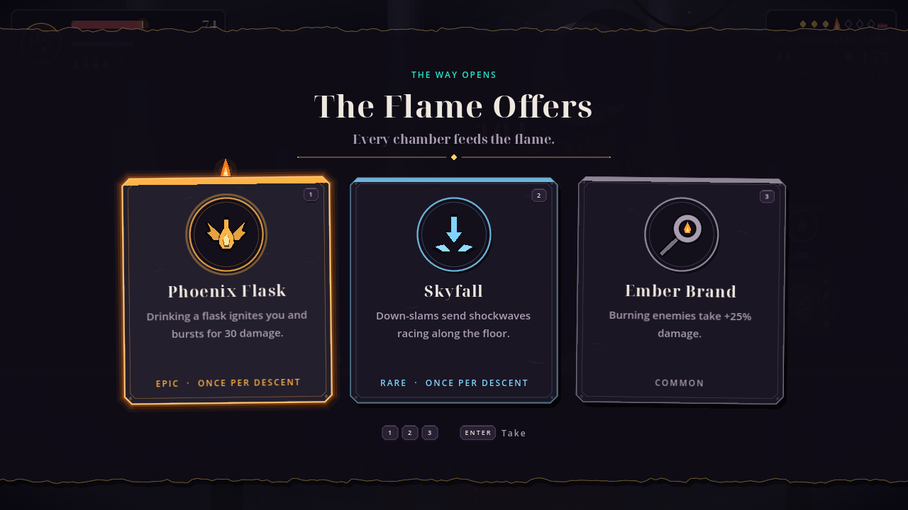
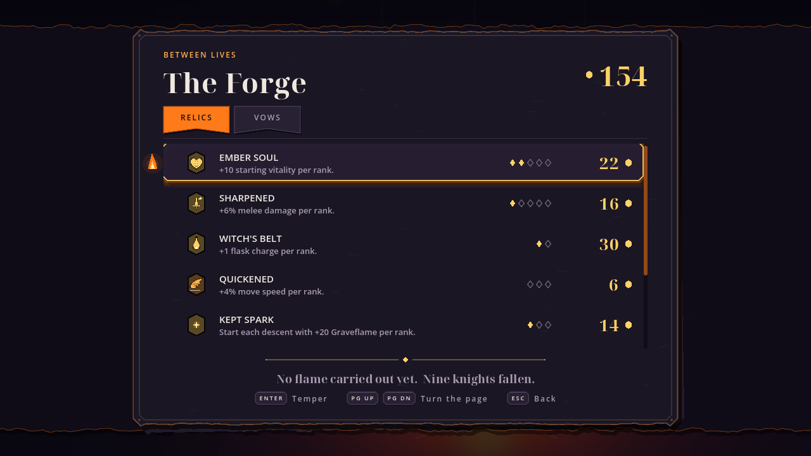

# Graveflame

*They light a flame on every knight's grave. Yours got up.*

A gothic 2D action-roguelite cut from paper. Parry, riposte and burn down through seven chambers of the keep, from the blue crypt through the amber works to the ash pit, to the throne where the Ember Warden waits.

  
  

  
  

## Play

1. Install [Godot 4](https://godotengine.org/download/) — tested with **4.7.2**.
2. [Download the source ZIP](https://github.com/bindusara-reddy/Graveflame/archive/refs/heads/main.zip) and extract it, or clone this repository.
3. In Godot's Project Manager, choose **Import**, select `project.godot`, then open the project and press **F5**.

On Linux, with `godot4` on your PATH, you can also run `./play.sh` from the project folder. It handles first-launch imports and NVIDIA hybrid-GPU settings automatically.

## Controls

| Action | Keyboard | Gamepad |
| :--- | :--- | :--- |
| Move · Jump | `A` / `D` · `Space` | Left stick or D-pad · `A` |
| Blade · Air slam | `J` · `Down` + `J` in the air | `X` · D-pad down + `X` in the air |
| Flame lance · Ignite | `K` · `Q` | `Y` · `RT` |
| Dash · Parry | `Shift` · `S` | `B` · `LB` |
| Flask · Enter rift | `F` · `E` | `LT` · `RB` or D-pad up |
| Pause | `Esc` | `Start` |

The arrow keys move and jump too. **The Forms** on the title screen lists every binding; change keys from **Senses**.

## Status

Playable from the first chamber to the throne and the ending past it, with original procedural paper-cutout art and synthesized audio. Pacing and difficulty are still being playtested.

[MIT license](LICENSE) · Title typeface: Noto Serif Display, [SIL Open Font License 1.1](fonts/NotoSerifDisplay-OFL.txt).
