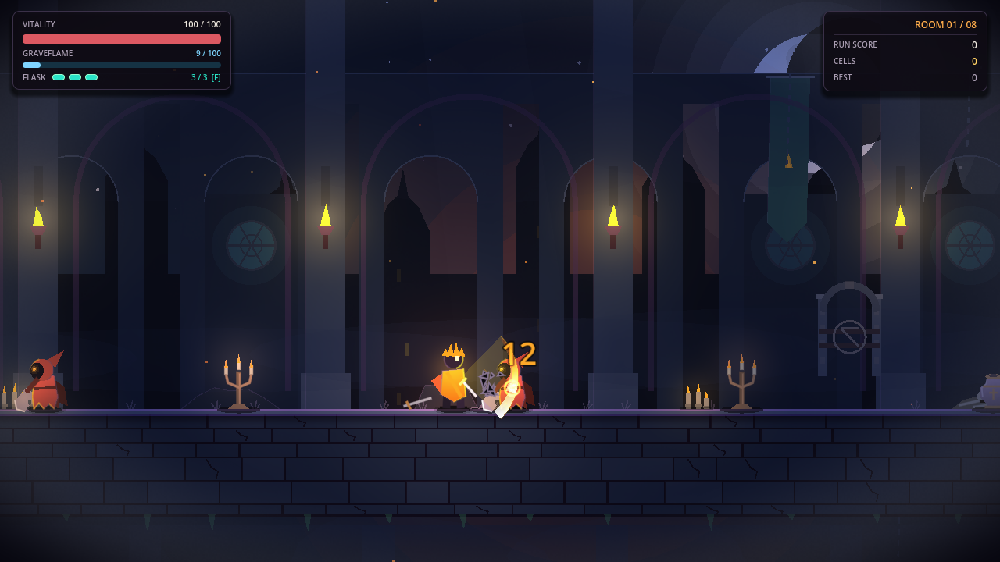

# Graveflame

A gothic action-roguelite: parry, riposte, and burn your way through eight chambers to the Ember Warden.

  
  

## Play

1. Install [Godot 4.3+](https://godotengine.org/) (tested with 4.7.2).
2. Clone this repository and open `project.godot` in Godot.
3. Press **F5**, or on Linux run `./play.sh` from the repository.

The Linux launcher selects NVIDIA graphics when available, disables V-Sync to avoid presentation stalls, and caps rendering at 120 FPS. Use `GRAVEFLAME_VSYNC=default ./play.sh` to retain project V-Sync, or `GRAVEFLAME_GPU=default ./play.sh` to leave GPU and presentation settings unchanged. On affected Linux systems, use the launcher rather than F5.

## Controls

`A/D` move · `Space` jump · `J` blade/riposte · `Down+J` air slam · `K` lance · `Q` ignite · `Shift` dash · `S` parry · `F` flask · `E` interact · `Esc` pause

Gamepad supported.

## Status

Playable development build with original procedural vector art and synthesized audio. Full-run pacing and difficulty are still being playtested.

## License

[MIT](LICENSE)
