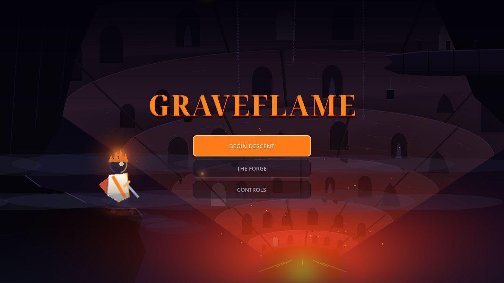
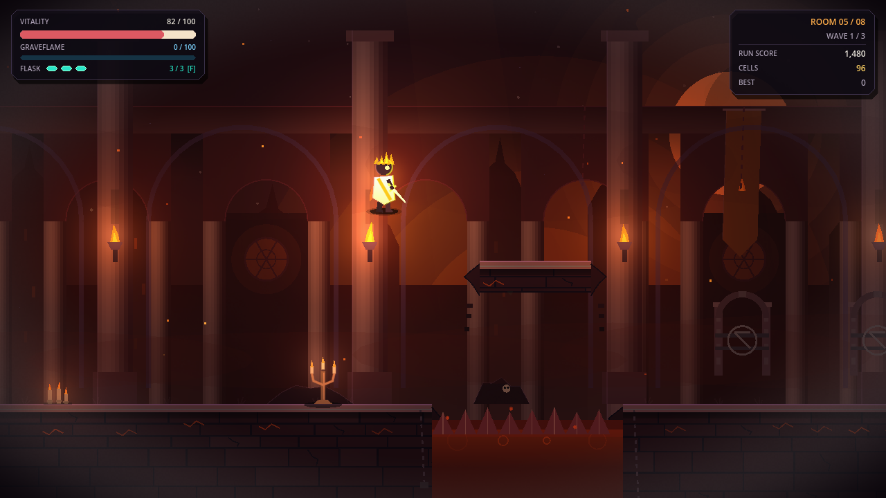

# Graveflame

A gothic 2D action-roguelite. Parry, riposte and burn through eight chambers to face the Ember Warden.

  
  

## Play

1. Install [Godot 4](https://godotengine.org/download/) — tested with **4.7.2**.
2. [Download the source ZIP](https://github.com/bindusara-reddy/Graveflame/archive/refs/heads/main.zip) and extract it, or clone this repository.
3. In Godot's Project Manager, choose **Import**, select `project.godot`, then open the project and press **F5**.

On Linux, with `godot4` on your PATH, you can also run `./play.sh` from the project folder. It handles first-launch imports and NVIDIA hybrid-GPU settings automatically.

## Controls

| Action | Keyboard |
| :--- | :--- |
| Move · Jump | `A` / `D` · `Space` |
| Blade · Air slam | `J` · `Down` + `J` while airborne |
| Flame lance · Ignite | `K` · `Q` |
| Dash · Parry | `Shift` · `S` |
| Flask · Interact | `F` · `E` |
| Pause | `Esc` |

Gamepad supported. Open **Controls** on the title screen for the full keyboard and gamepad bindings.

## Status

Playable development build with original procedural vector art and synthesized audio. Pacing and difficulty are still being playtested.

[MIT license](LICENSE) · Title typeface: Noto Serif Display, [SIL Open Font License 1.1](fonts/NotoSerifDisplay-OFL.txt).
