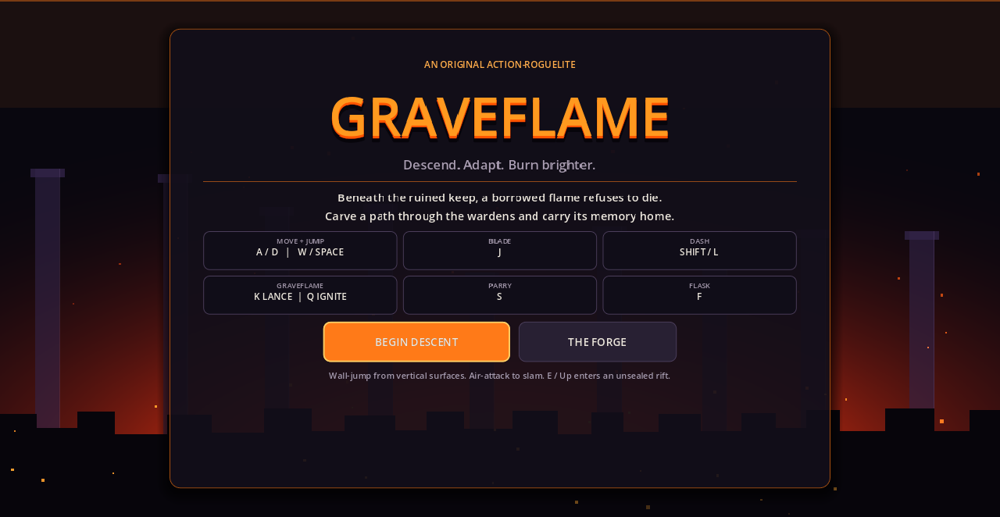
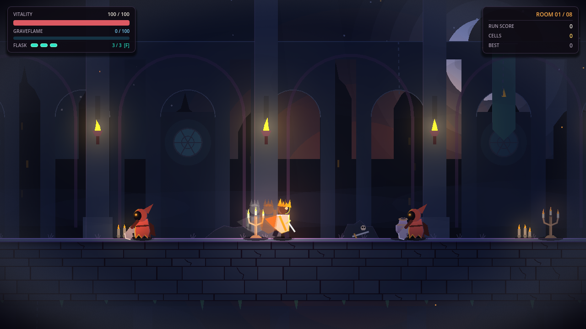
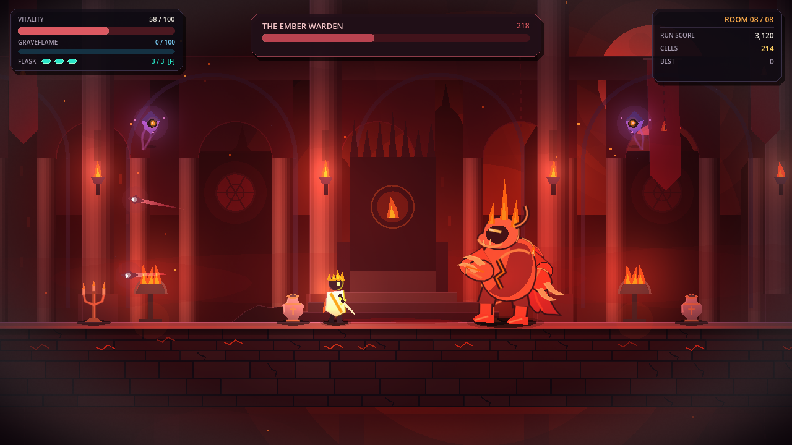
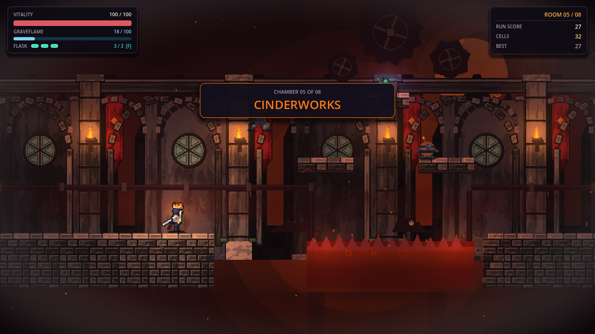
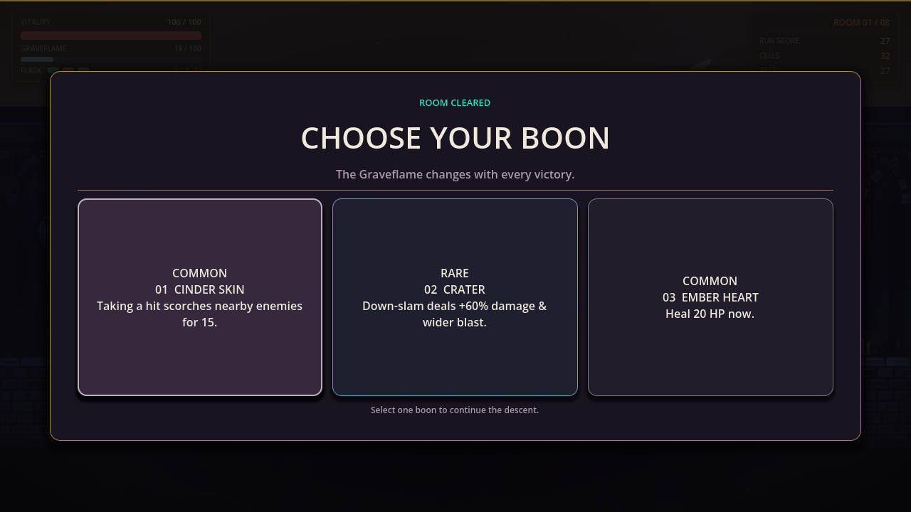

# Graveflame



<p align="center">
  
  
</p>

<p align="center">
  
  
</p>

## Play

1. Install [Godot 4.3+](https://godotengine.org/).
2. Open `project.godot`.
3. Press **F5** (or run `godot4 --path .`).

## Controls

`A/D` move · `Space` jump · `J` blade · `K` lance · `Q` ignite · `Shift` dash · `S` parry · `F` flask · `E` interact · `Esc` pause

Gamepad supported out of the box.

## Tests

```sh
godot4 --headless --path . --script res://tests/test_runner.gd
godot4 --headless --path . --script res://tests/runtime_smoke.gd
```

## Status

Playable vertical slice. Procedural vector art, dynamic 2D lighting, and synthesized procedural audio.

## License

[MIT](LICENSE)
